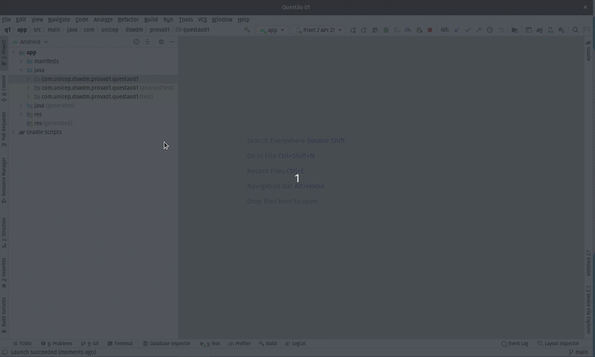
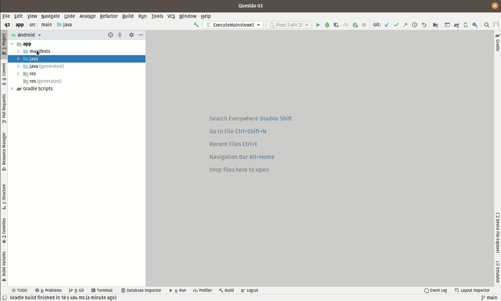

# Prova de Desenvolvimento para Web e Dispositivos Móveis II (Sistemas de Informação 1s2021).

Implementação de conceitos de MVVM, MVC, RecycleView, OOP, UML dentre outros.

--------------------------------

### Introdução

Neste repositório estão contidos as implementações solicitadas (4 questões) na prova de Desenvolvimento para Web e Dispositivos Móveis II, do curso de Sistemas de Informação, da Unicep (unidade Rio Claro - SP).

As implementações, tem caracter único e especificamente pedagógico, e não refletem um mundo real (corporativo), mas podem ser usados para consultas e entendimento das implementações.

A criação do repositório (assim como o devido conteúdo), além de ser uma objeto de avaliação (como já citado), também é uma forma de compartilhar o conhecimento aqui presente.

### Sumário

[Introdução](#introdução)

[Questão 01](#questão01)

[Questão 02](#questão02)

[Questão 03](#questão03)

[Questão 04](#questão04)

[Referências](#referências)

----------------

### Questão 01

> Para essa questão crie um projeto no diretório q1 do seu projeto raiz e então construa uma aplicação em Android com uma activity em branco e que implemente o uso do padrão Model-View-Controller (MVC). Nesse caso, utilize a classe ViewModel para representar um objeto do tipo controller. Nessa classe de ViewModel construa um método para listar 1.000 itens do tipo inteiro. Exiba os valores no console usando o Log.d(...). Para isso use o método Randon disponível no endereço:
> https://kotlinlang.org/api/latest/jvm/stdlib/kotlin.random/-random/

#### Resposta questão 01

### Questão 02

> Para essa questão crie um projeto no diretório q2 do seu projeto raiz e então construa uma aplicação em Android com uma activity em branco que represente a seguinte modelagem de dados (Person e Book) (vide Figura abaixo). Também implemente os relacionamentos (Dependency, Association, Aggregation, Composition). Exiba os valores no console usando o Log.d(...) com a criação dos relacionamentos indicados no endereço eletrônico: 
> http://www.cs.utsa.edu/~cs3443/uml/uml.html

#### Resposta questão 02

### Questão 03

> Para essa questão crie um projeto no diretório q3 do seu projeto raiz e então construa uma aplicação em Android que represente a seguinte modelagem de dados (Document, Book e Email) (vide Figura abaixo). Crie uma lista randomizada de itens do tipo Email e itens do tipo Book. Use Log.d(...) para exibir a listagem. Pontuação extra – Se for usado o Pattern Strategy
> Links:
> http://www.cs.utsa.edu/~cs3443/uml/uml.html
> https://refactoring.guru/design-patterns/strategy

#### Resposta questão 03

- Solução 1

- Solução 2

- Solução 3

### Questão 04

> Para essa questão crie um projeto no diretório q4 do seu projeto raiz e então construa uma aplicação MVC em Android que exiba uma listagem de Livros (com no mínimo titulo e autores) seguindo os princípios de Orientação a Objetos (OO). Para isso, construa uma tela que carregue dinamicamente através de um método loadBooks() uma listagem com objetos gerados em um RecyclerViwer do Android.

#### Solução 04

### Referências

- [Referência para questões](http://www.cs.utsa.edu/~cs3443/uml/uml.html) 
- [Design PatternStrategy](https://refactoring.guru/design-patterns/strategy)
- [RecyclerView](https://developer.android.com/guide/topics/ui/layout/recyclerview?hl=pt-br)
- [CardView](https://developer.android.com/jetpack/androidx/releases/cardview)
- [Glide](https://bumptech.github.io/glide/doc/download-setup.html)
- [Github - aceiro/dogs2021](https://github.com/aceiro/dogs2021)
- [Github - aceiro/listadessoft](https://github.com/aceiro/listadessoft)

